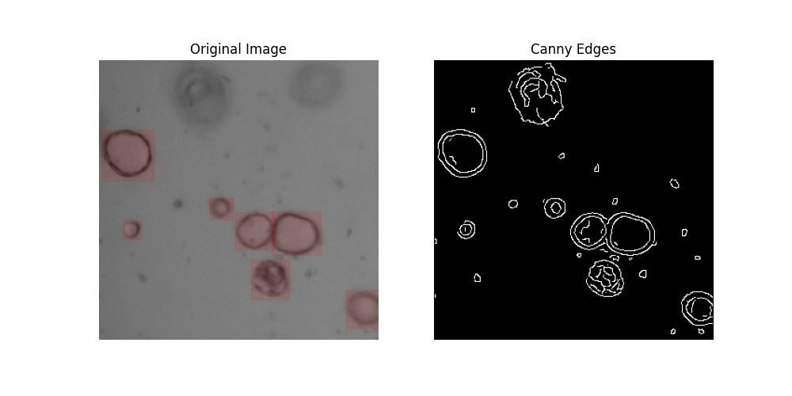
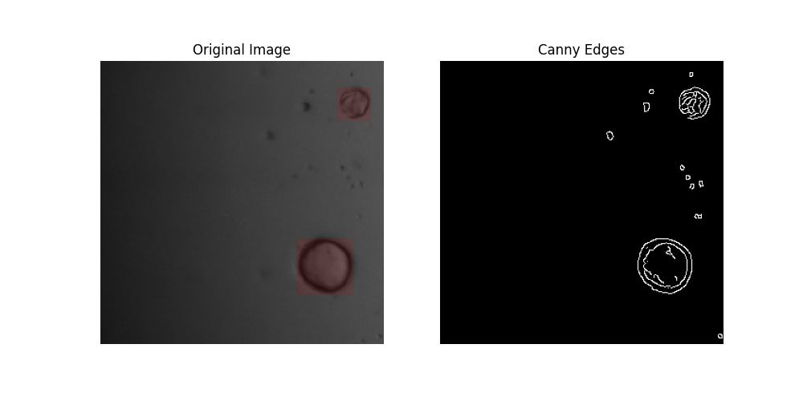

# Organoid Detection

In May 2022, Lizzie Kumar, Alex Wong, and I trimmed Yolo V3. We showed that training from scratch doesn't work.

### Work in Progress, Image Detection Evolved:
1. Basic techniques
    1. Based on the dataset, and the canny edges, organoids are circles with deep black countours (say, intensity < 64) that are 3-5 pixels wide. Some could have rough patterns in the center; most don't.
    
    
    <!-- 2. Ask CoPilot, "How do I filter out high intensity circles using OpenCV?". CoPilot recommends Gaussian blur and Hough Circles. -->
2. Minimum viable product: Fine-tune a pretrained model using HuggingFace
    1. Data preprocessing: this step produces [metadata.jsonl](data/train/metadata.jsonl) for HuggingFace default loading script to use.
3. Potentially higher accuracy: use a multi-modal LLM API
4. High throughput version: Training using only Canny edges and bounding boxes

